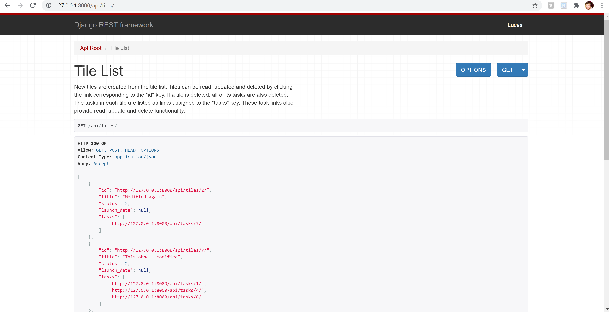

# Introduction

The aim of this project is to create a simple API using Django Rest Framework which allows interaction between two Django models. I have used HyperlinkedModelSerializer classes and ModelViewSets
to make the API as RESTful as possible, while allowing for full CRUD functionality with the simplest code possible. 

## Technologies

Python 3.6.2, Django==2.2.24, Django Rest Framework== 3.10.0, Coverage==5.5, Black

## Getting Started

Please follow the instructions below to run this application. 

1 - download this repo as a zip file and unzip it to your working directory.  
2 - install Python 3.6.2 or later

## (Optional) Create and use a virtual environment:
## https://packaging.python.org/guides/installing-using-pip-and-virtual-environments/#creating-a-virtual-environment
```python -m venv env```

```source env/bin/activate```

## Install dependencies:
## https://pip.pypa.io/en/stable/user_guide/#requirements-files
```pip install -r requirements.txt```

## Run my tests (all should pass):
```python manage.py test```

## Optional: run Coverage (using batch file) to receive a test coverage report in stdout
```cvrg.bat```

## Build the database:
```python manage.py migrate```

## Start the Django development server:
## https://docs.djangoproject.com/en/3.2/ref/django-admin/#django-admin-runserver
```python manage.py runserver```

After these commands, you should be able to see the homepage at http://localhost:8000/.

You will need to create a super user if you want to access the Django admin site (https://docs.djangoproject.com/en/3.2/ref/contrib/admin/): to do this, 
run `python manage.py createsuperuser` and follow the instructions.

## Project Status

Still being developed. 
###### To do:

- add permissions/logins

- add stricter tests for updating object fields

- use Django mixers for tests or try Factory Boy and Faker packages

- add gettext_lazy wherever required for future translations

- add help_text where useful

- add constraint check so that it's not possible to save invalid choices in the Django shell

- consider changing tasks HyperlinkedRelatedField serializer in the TileSerializer to a basic string serializer, which would show better information about the tasks in the Tile, but at the cost of not having a hyper-link to more easily navigate to said tasks

- add better messages for all endpoints

- produce more detailed documentation using Swagger or another package


